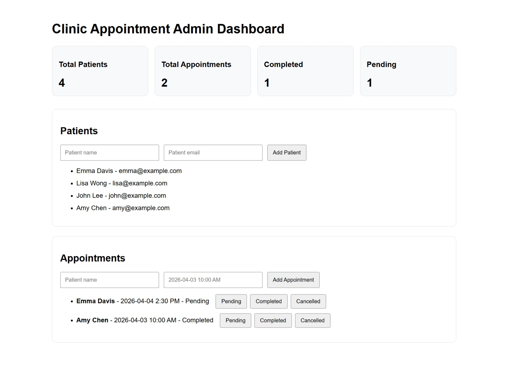
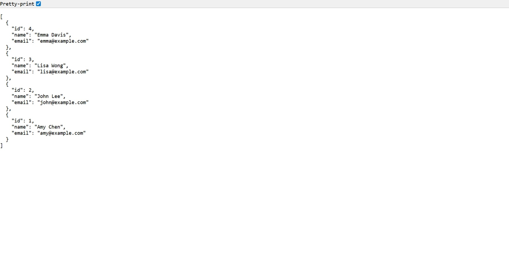
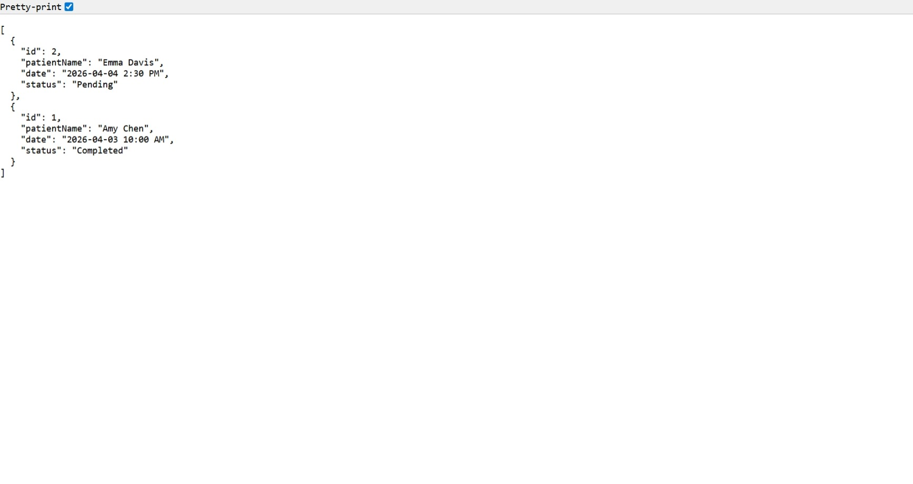

# Clinic Appointment Admin Dashboard

A full-stack healthcare-style admin dashboard for managing patient records and appointment workflows.  
This project includes an Angular frontend, an ASP.NET Core Web API backend, and SQLite for persistent storage with demo data.

## Screenshots

### Dashboard Overview

### Patients API

### Appointments API

## Tech Stack

- Angular
- TypeScript
- C#
- ASP.NET Core Web API
- SQLite
- HTML/CSS

## Features

- Manage patient records with create, read, update, and delete operations
- Create and track appointments in an admin dashboard
- Update appointment statuses for workflow management
- View dashboard metrics for patients and appointments
- Persist demo data with SQLite
- Connect Angular frontend components to ASP.NET Core REST APIs

## Project Structure

- `backend/ClinicApi` — ASP.NET Core Web API + SQLite database
- `frontend/clinic-dashboard` — Angular frontend
- `docs/screenshots` — README images

## API Overview

Sample endpoints include:

- `GET /api/patients`
- `POST /api/patients`
- `PUT /api/patients/{id}`
- `DELETE /api/patients/{id}`
- `GET /api/appointments`
- `POST /api/appointments`
- `PUT /api/appointments/{id}`
- `PUT /api/appointments/{id}/status`

## How to Run Locally

### Backend

`cd backend/ClinicApi`  
`dotnet run`

### Frontend

`cd frontend/clinic-dashboard`  
`npx ng serve`

Then open the Angular app in your browser and make sure the frontend is connected to the backend API.

## Demo Data

This repository includes a demo SQLite database file (`clinic.db`) with sample data for local demonstration and UI testing.

## What I Built

- Built a full-stack healthcare-style admin dashboard for patient and appointment management
- Developed ASP.NET Core REST APIs for CRUD operations and status updates
- Built Angular UI components for dashboard metrics, patient intake, appointment tracking, and admin actions
- Used SQLite to persist demo data and support end-to-end workflow testing